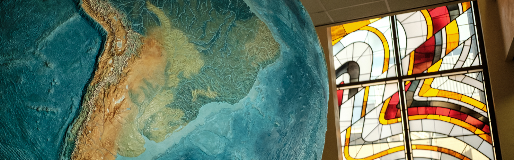
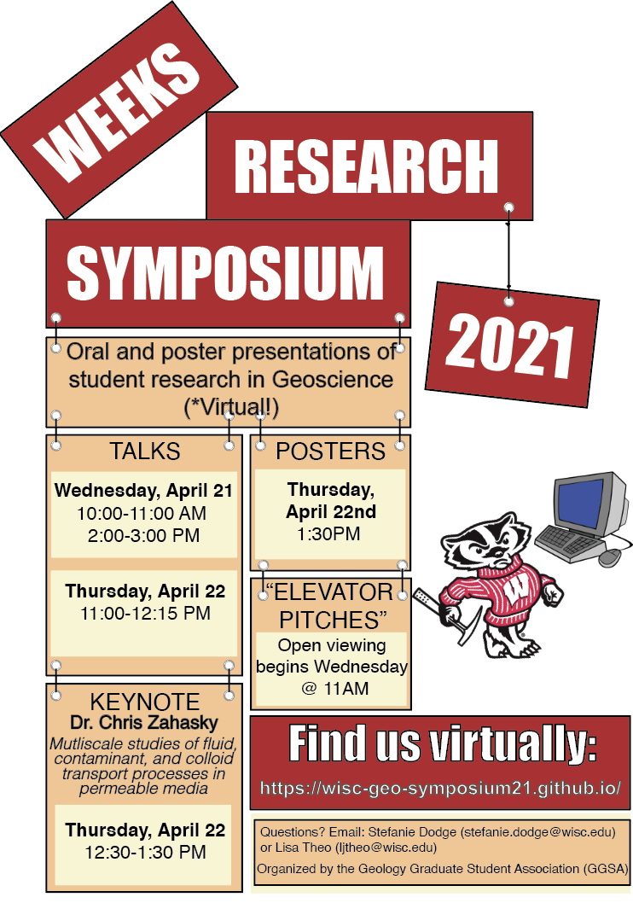

## April 21 - 22, 2021

Hello, and welcome to the virtual meeting space of the **2021 Weeks Research Symposium**! Due to the fact we all can’t meet in person for this event, we have created this website to post the schedule of all oral, poster, and elevator pitch (_**new this year!**_) presentations that will be given by undergraduate and graduate students in the [UW-Madison Department of Geoscience](http://geoscience.wisc.edu/geoscience/) for this event.  

The symposium will be held on Wednesday April 21st to Thursday April 22nd. The schedule will follow the typical format of hosting three sessions of [AGU-style talks](https://wisc-geo-symposium21.github.io/pages/oral/oral_index) (12 min +3 min for questions), concluded by an invited [keynote lecture](https://wisc-geo-symposium21.github.io/pages/keynote) by Dr. Chris Zahasky. We also will be hosting a [virtual poster session](https://wisc-geo-symposium21.github.io/pages/poster/poster_index), as well as a video compilation of [elevator pitches](https://wisc-geo-symposium21.github.io/pages/elevator_pitch/elevator_pitch_index) where students give a 3-minute run down on their research (think of these as “lightning” talks).  

We hope this will be a fun, interactive experience for you all, and an effective temporary platform until we can all meet again next year for an in-person Symposium!  

Special thanks to the 2021 Weeks Research Symposium Planning Committee: Stefanie Dodge, Lisa Theo, Lisa Haas, Shan Ye, Cameron Batchelor, Yihang Fang, Chelsea Volpano.

