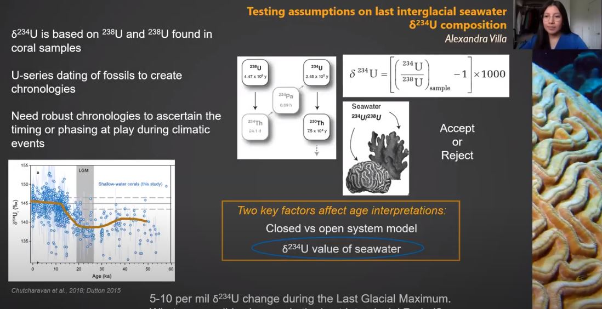

#  Testing assumptions on last interglacial seawater δ234U composition

**Alexandra Villa**

**Abstract**: The use of U-series dating of fossil corals has proved to be a crucial tool in creating Last Interglacial (LIG) chronologies of sea level change. These archives preserve the primary chemistry used to calculate a radiometric age, and track the position in sea level using their assumed paleodepth habitat. Using the U-series dating, we can achieve extremely accurate and precise measurements of age and elevation, under the assumption of presumed LIG δ234U value of seawater. This has been assumed to reflect modern day values of about 145‰, given the fact that U in the ocean is relatively constant. However, recent studies have suggested a 5-10 per mil δ234U change during the LGM, which challenges the assumption that LIG fossil corals reflect modern day values. This study seeks to determine possible values and changes in LIG δ234U values through a series of leaching experiments.

**Advisor**: Andrea Dutton

**Email**: [avilla2@wisc.edu](mailto:avilla2@wisc.edu)

#### Video

