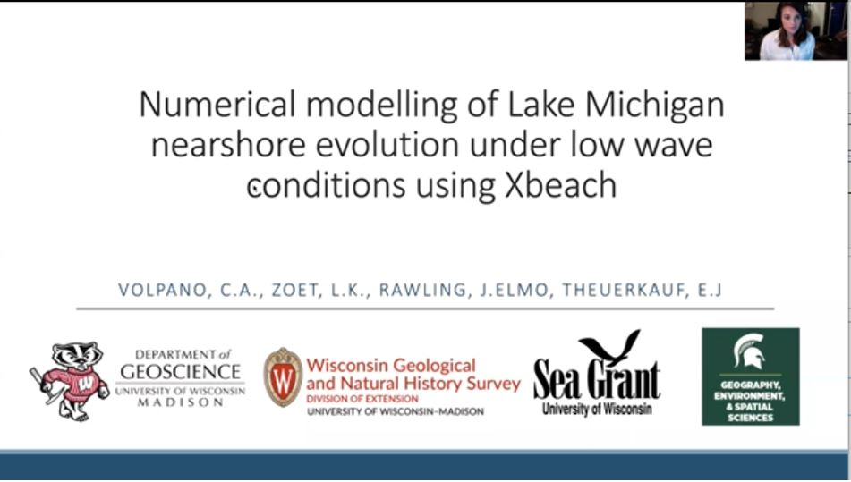

#  Numerical modelling of Lake Michigan nearshore evolution under low wave conditions

**Alexandra Villa**

**Abstract**:  Coastal erosion is currently exacerbated by above average water levels in Lake Michigan. The increased rate of shoreline erosion has called attention to the lack of predicative tools for coastal management that can simulate conditions that are likely to cause extensive property damage or introduce large volumes of sediment to the littoral system. Numerical models are not commonly applied to simulate the response of Lake Michigan beaches to different hydrodynamic conditions, leading to knowledge gaps on how long term elevated lake levels influence nearshore evolution and sediment transport. We applied the open source nearshore hydrodynamic model Xbeach to a sandy beach on the western shore of Lake Michigan. Two topobathymetric surveys were conducted approximately 1 month apart. We calibrated site specific sediment transport parameters within the model and then compared the predicted morphologic change to that observed in our surveys. We also collected nearshore wave data to determine how basin scale model outputs of offshore wave conditions influence nearshore morphodynamic simulations. Results show that predicting morphodynamic change under low wave conditions on these temporal scales is at the limit of detection for our survey methodology and the capabilities of Xbeach. This is significant because it suggests that it is difficult to analyze the impacts of seasonal increases in water levels during typically low wave conditions.

**Advisor**: Luke Zoet

**Co-Authors**: Zoet, L.K., Rawling, J.Elmo, Theuerkauf, E.J

**Email**: [cvolpano@wisc.edu](mailto:cvolpano@wisc.edu)

#### Video

