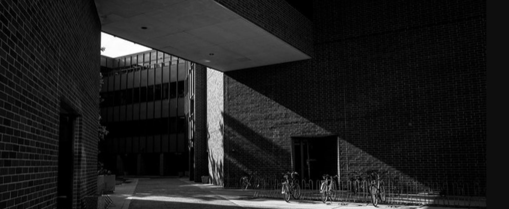

# Elevator Pitches

#### Lineup

| Presenter   | Title       | Link |
| ----------- | ----------- |------|
| Jeremy Brooks    | Laboratory simulations of glacial abrasion |  [Abstract](https://wisc-geo-symposium21.github.io/pages/elevator_pitch/jbrooks)|
| Stefanie Dodge  | The Effects of Ice on Coastal Erosion |  [Abstract](https://wisc-geo-symposium21.github.io/pages/elevator_pitch/sdodge)|
| Lisa Haas  | Microbially‐mediated oxidation of trace element‐bearing sulfide minerals in Cambrian Sandstones of Trempealeau County, WI |  [Abstract](https://wisc-geo-symposium21.github.io/pages/elevator_pitch/lhaas)|
| Jacob Klug  | Intercalibration of the Servicio Nacional de Geología y Minería (Sernageomin), Chile and WiscAr 40AR/39AR Laboratories for Quaternary Dating |  [Abstract](https://wisc-geo-symposium21.github.io/pages/elevator_pitch/jklug)|
| Ethan Parrish  | A Tale of Two Rivers: A Source-To-Sink Comparative Analysis of The Aspen and Idaho Paleoriver Systems  |  [Abstract](https://wisc-geo-symposium21.github.io/pages/elevator_pitch/eparrish)|
| Alexandra Villa  | Testing assumptions on last interglacial seawater δ234U composition |  [Abstract](https://wisc-geo-symposium21.github.io/pages/elevator_pitch/avilla)|
 | Chelsea Volpano  | Numerical modelling of Lake Michigan nearshore evolution under low wave conditions|  [Abstract](https://wisc-geo-symposium21.github.io/pages/elevator_pitch/cvolpano)|
