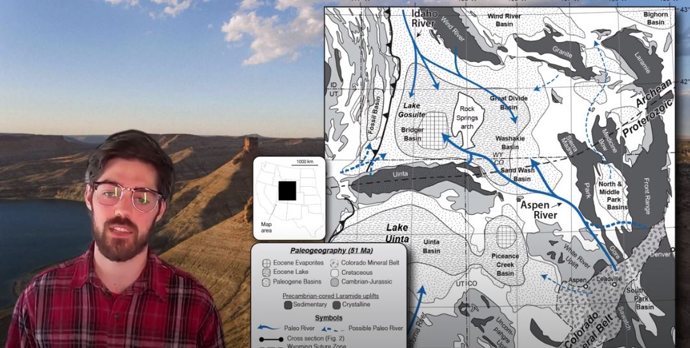

#  A Tale of Two Rivers: A Source-To-Sink Comparative Analysis of The Aspen and Idaho Paleoriver Systems

**Ethan Parrish**

**Abstract**: The well exposed early Eocene, lacustrine Green River Formation (GRF) of southwestern Wyoming captures the interplay between two well documented paleoriver systems and offers an ideal locality for a source-to-sink (S2S) study of a lacustrine-terminating system. To date, S2S analysis has been largely limited to either modern or marine-terminating sediment routing systems (SRSs), in part due to the challenges of studying complete SRSs in the ancient. These challenges include temporal/geographic constraint, and sedimentologic closure, of the system, as well as the lack of preservation of source areas, and the incompleteness of the stratigraphic record. Ancient lakes present compelling localities for S2S studies as they offer the potential to systematically address several of these challenges. A rich history of research in the GRF has resulted in an unparalleled basin-scale temporal framework and a foundation on which a holistic S2S study can be built. Until recently, however, interest in the GRF has largely focused on the system's sink. Recent and ongoing research has begun to ameliorate this issue by employing detrital zircon (DZ) analysis paired with petrographic and paleocurrent analysis to investigate the provenance of the two primary fluvial systems feeding the GRF, namely the Aspen and Idaho paleorivers. Studies of both SRSs has revealed sedimentation to be more complex than previously recognized, with distal and local sediment sources playing important roles in both. Despite coeval deposition, however, deposits from both SRSs differ significantly. The present research seeks to compare the two SRSs feeding the GRF, on the basis of sediment caliber, composition, volume, and fluvial architecture, both in the field and using acquired 3D models, to 1) understand the propagation and preservation of early Eocene hypothermal signals, which may aid our understanding of our warming climate today, and 2) to improve and broaden the applicability of S2S analysis in general.

**Advisor**: Alan Carroll

**Email**: [eparrish3@wisc.edu](mailto:eparrish3@wisc.edu)

#### Video

