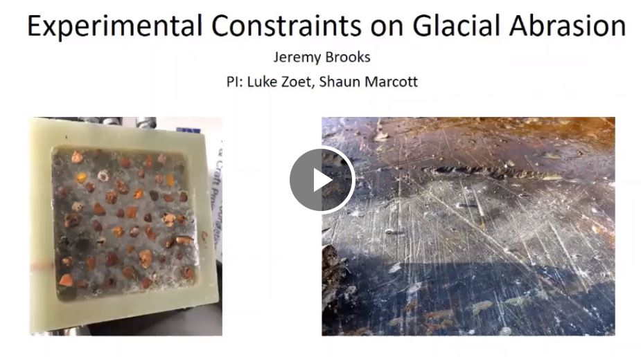

# Laboratory simulations of glacial abrasion

**Jeremy Brooks**

**Abstract**: Glacial erosion is an important process for landscape development on geological timescales. However, the factors that control glacial erosion are not well-constrained quantitatively, therefore landscape evolution models for glaciated terrain are unreliable. Numerous mathematical relationships have been proposed to predict glacial abrasion rate given certain parameters, but they differ in functional form and parameterization. None of the proposed abrasion rate relationships are unequivocally supported by field evidence; possibly related to the difficulty in accurately measuring abrasion rate (and the parameters it depends upon) in the field. Therefore, laboratory experiments conducted under realistic glaciological conditions have the potential to empirically verify the parameterization of an abrasion rate function. Here, we describe experiments to simulate glacial abrasion by sliding rock slabs underneath debris-laden ice. We systematically vary the clast concentration, the clast contact force, and the relative clast hardness. Preliminary results illustrate the dependence of abrasion rate on clast contact force. These experiments enable the formulation of an empirically-verified “abrasion wear law” that describes abrasion rate given glaciological and geological parameters. This abrasion wear law can be incorporated into landscape evolution models of glaciated terrain.

**Advisor**: Lucas Zoet

**Co-Authors**: Lucas Zoet, Shaun Marcott, Dougal Hansen

**Email**: [jeremy.brooks@wisc.edu](mailto:jeremy.brooks@wisc.edu)

#### Video

