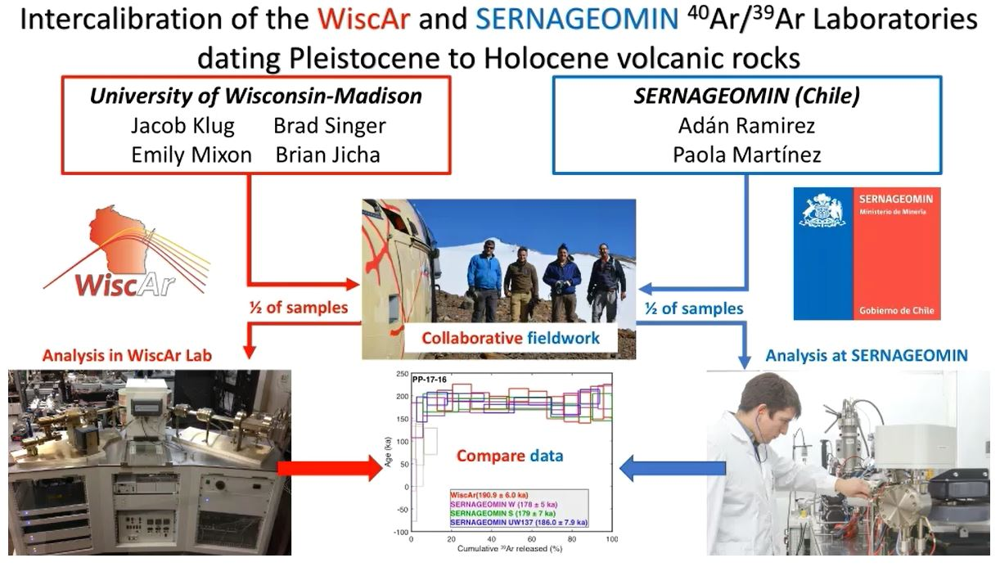

#  Intercalibration of the Servicio Nacional de Geología y Minería (SERNAGEOMIN), Chile and WiscAr 40Ar/39Ar Laboratories for Quaternary Dating

**Jacob Klug**

**Abstract**: The 40Ar/39Ar method is employed to date many types of volcanic materials, however, dating young (<150 ka) K2O poor samples can be challenging owing to low radiogenic 40Ar* contents, which can be difficult to distinguish from trapped atmospheric argon. To address this challenge, a collaborative intercalibration between the UW-Madison WiscAr and SERNAGEOMIN labs is underway on a common set of samples. Groundmass and plagioclase samples were analyzed on a 5-Collector Noblesse mass spectrometer, whereas measurements in the SERNAGEOMIN lab were performed using an ARGUS VI spectrometer. Intercalibration samples were collected from three Andean SVZ volcanoes to test the capability of each lab in dating different materials. Lava flows were collected from Planchon-Peteroa and Calbuco Volcano. Single crystals of plagioclase were separated from pumice collected from two outcrops of the >450 km3 Diamante (Pudahuel) ignimbrite sourced from the Diamante Caldera. Multiple rounds of experiments include co-irradiation of samples at Oregon State University, as well as irradiations using the reactor in Chile to investigate differences in neutron fluence procedure and parameters. Although less precise than plateau ages, all isochron ages generated in the two labs agree at 2σ. All co-irradiated samples from Planchon-Peteroa yield plateau ages that also show inter-lab agreement at 2σ. The low K2O lavas from Calbuco are more challenging with only 1 out of 5 plateau ages in agreement between labs. Differences in the variability of the 36Ar blanks between the two labs may explain the discrepancy. Single plagioclase crystals analyzed from each outcrop of the Diamante ignimbrite differed significantly in precision and highlight the difficulties in dating young tephra deposits. Single crystals analyzed in each lab from sample PUD-15-02 yielded precise ages (WiscAr: 126.3 ± 2.5 ka and SERNAGEOMIN: 131.5 ± 2.7 ka) that agree at 2σ and highlight the capability of each lab to date young tephras.

**Advisor**: Brad Singer

**Co-Authors**: Jacob Klug, Adán Ramirez, Emily E Mixon, Brad Singer, Brian R Jicha, Paola Martinez

**Email**: [jdklug@wisc.edu](mailto:jdklug@wisc.edu)

#### Video

