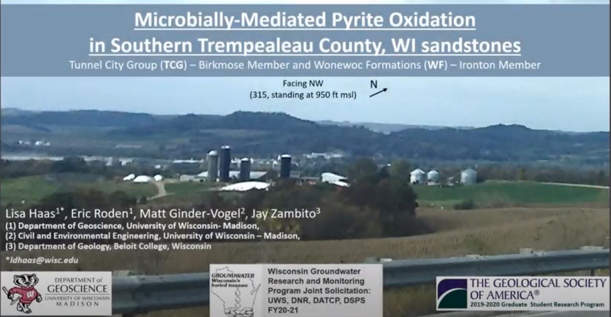

# Microbially-mediated oxidation of trace element-bearing sulfide minerals in Cambrian Sandstones of Trempealeau County, WI

**Lisa Haas**

**Abstract**: Iron disulfide (pyrite) mineral oxidation in circumneutral pH (subsurface) environments is a relevant groundwater quality subject for Wisconsin's sandstone and carbonate Cambrian-Ordovician aquifer system. This aquifer system has been observed to host varying abundances of metal-sulfide minerals, such as pyrite, across Wisconsin. Pyrite can oxidize, or degrade, when exposed to oxygenated groundwater or earth-surface conditions. Acid is generated during this reaction and could exceed the buffering capacity of the groundwater. Divalent metal(loid)s go into solution in acidic environments.

We carried out ex situ microcosm experiments, monitoring chemical and biological parameters indicative of active, microbial pyrite oxidation (sulfate production, pH, cell viability). The microcosms contained ceramic-pulverized ex situ sandstone with either natural, negligible, or spiked abundances of pyrite with unadulterated groundwater containing live bacteria. Groundwater was collected from a private well pumping from same geologic unit(s) as the geologic material in the experiment.

One microcosm treatment showed a 5x greater rate of sulfate production (0.2 to 3 mM) in circumneutral pH after 86 days in live microcosms with natural abundance of pyrite compared to their abiotic controls. 16S rRNA genes was extracted from that treatment identified eletroautotrophic- and chemolithotrophic-like bacteria. Results imply accelerated microbially-mediated pyrite oxidation in circumneutral pH.

**Advisor**: Eric Roden

**Co-Authors**: Eric Roden, Matt Ginder-Vogel, Jay Zambito

**Email**: [ldhaas@wisc.edu](mailto:ldhaas@wisc.edu)

#### Video

