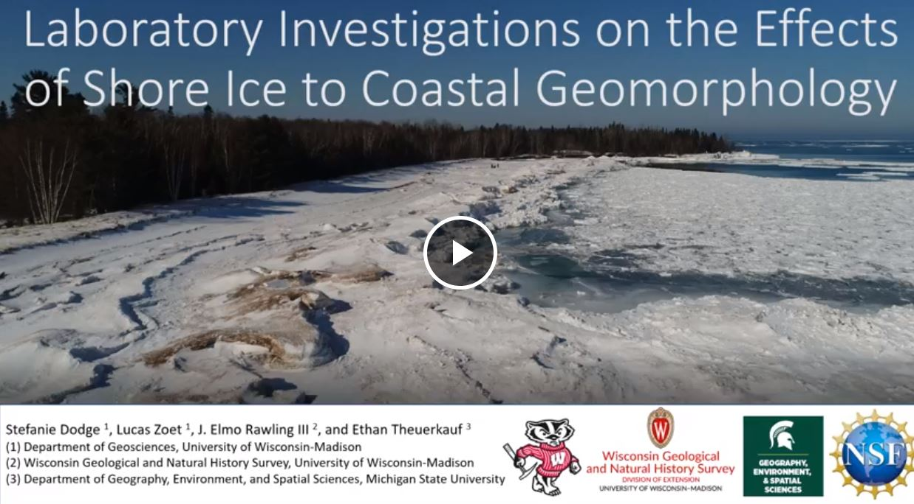

# The Effects of Ice on Coastal Erosion

**Stefanie Dodge**

**Abstract**: Winter shore ice alters sediment transport in the nearshore and accurate modeling of coastal evolution in cold climates is hindered by a limited understanding of these processes. Consistent ice cover likely buffers the upper shore face from the erosive impacts of winter storm waves, while shorelines with ice subject to breakup events likely enhances erosion and sediment transport. Previous work has shown that shore fast ice has the capability to entrain and transport large volumes of sediment away from the nearshore, however, there is limited data on rates of sediment transport and a lack of quantitative information on the mechanics of sediment entrainment. To quantify how cold climate shorelines will respond to reduced winter ice cover associated with climate change we use a combination of field investigations and laboratory experiments to better understand the processes that lead to sediment entrainment within shore ice.

Ice cores were collected from five beach sites around Lake Superior and Lake Michigan. In locations near the shoreline and below ridges, ice cores contained frozen on basal sediment. Ice cores were melted, and sediment content was measured. A large flume was constructed and used to simulate the effect of wave motion on sediment entrainment in shore ice. A plunging wave generator at one end of the flume, propagates waves through the sample chamber. A sediment bench with ramp simulates beach, nearshore, and offshore environments. A ring shear device was used to simulate how the ice cores with debris frozen to the base could be ripped away from the bed by wave action or ice shove. This device rotates an annulus of ice that has been frozen into a thick bed of saturated coarse sand. Cameras mounted on the side wall monitor the movement of sediment within the chamber. Using this device, we can estimate the stress needed to rip it away and determine if the strength of the system is regulated by the sediment or some combination of the ice and sediment.

**Advisor**: Lucas Zoet

**Co-Authors**: Luke Zoet, Elmo Rawling, Ethan Theuerkauf

**Email**: [stefanie.dodge@wisc.edu](mailto:stefanie.dodge@wisc.edu)

#### Video

