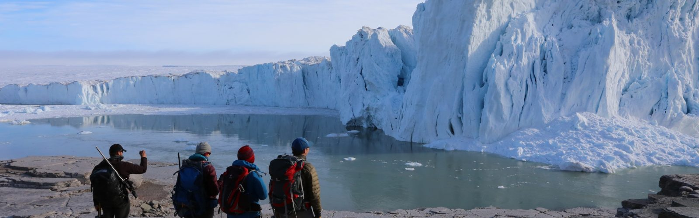

# Oral Presentations

## Schedule

Live stream of oral presentations on Zoom can be accessed [here](https://uwmadison.zoom.us/meeting#/test11111).

#### April 21 Morning

| Presenter   | Title       | Time  | Link |
| ----------- | ----------- |-------|------|
| Jeremy Patterson  | A Generalized Approach to Aquifer Characterization and Uncertainty Quantification Through Oscillatory Flow Interference Testing | 10:00 | [Abstract](https://wisc-geo-symposium21.github.io/pages/oral/jpatterson)|
| Ben Heath  | Fracturing and pore fluid distribution in the Marlborough region, New Zealand from body-wave tomography: Implications for regional understanding of the 2016 Kaikoura Earthquake | 10:15 | [Abstract](https://wisc-geo-symposium21.github.io/pages/oral/bheath)|
| Claudia I. Roig | Testing the detachment fault refrigeration hypothesis at high-spatial resolution by SIMS oxygen isotope analysis. | 10:30 | [Abstract](https://wisc-geo-symposium21.github.io/pages/oral/croig)|
| Youjuan Li  | New 40Ar/39Ar and U-Pb age determination of magnetochron M0r from the Qingshan Group, Jiaolai Basin, eastern China | 10:45 | [Abstract](https://wisc-geo-symposium21.github.io/pages/oral/yli)|

#### April 21 Afternoon

| Presenter   | Title       | Time  | Link |
| ----------- | ----------- |-------|------|
| Benjamin Bruck  | Tectonic and astronomical influences on climate and deposition revealed by a Bayesian age-depth model of the Early Eocene Green River Formation, Wyoming | 14:00 | [Abstract](https://wisc-geo-symposium21.github.io/pages/oral/bbruck)|
| Daniel Segessenman  | Environmental expression of the Shuram-Wonoka carbon isotope excursion in North America | 14:15 | [Abstract](https://wisc-geo-symposium21.github.io/pages/oral/dsegessenman)|
| Shan Ye  | Assessment of Dinosaur Diversity and Sediment Coverage in Cretaceous North America | 14:30 | [Abstract](https://wisc-geo-symposium21.github.io/pages/oral/yeshan)|
| Nicholas Sullivan | Early Miocene cyclostratigraphy in the Southern Ocean: A window into the history of the Antarctic Ice Sheet | 14:45 | [Abstract](https://wisc-geo-symposium21.github.io/pages/oral/nsullivan)|

#### April 22 Morning

| Presenter   | Title       | Time  | Link |
| ----------- | ----------- |-------|------|
| Kai Hu   | Covariation of cross-divide differences in denudation rate and χ: Implications for drainage basin reorganization in the Qilian Shan, northeast Tibet | 10:00 | [Abstract](https://wisc-geo-symposium21.github.io/pages/oral/khu)|
| Shan Ye  | Climatological effects on surface exposure dating | 10:15 | [Abstract](https://wisc-geo-symposium21.github.io/pages/oral/sye)|
| Dougal Hansen  | Experimental insight into the entrainment and transport of subglacial debris | 10:30 | [Abstract](https://wisc-geo-symposium21.github.io/pages/oral/dhansen)|
| Andrew Jones  | Holocene glacier length variations along the American Cordilleras from paired 14C-10Be measurements | 10:45 | [Abstract](https://wisc-geo-symposium21.github.io/pages/oral/ajones)|
| Nathan Stevens  | A Seven Decade History of Flow at Saskatchewan Glacier | 11:00 | [Abstract](https://wisc-geo-symposium21.github.io/pages/oral/nstevens)|
