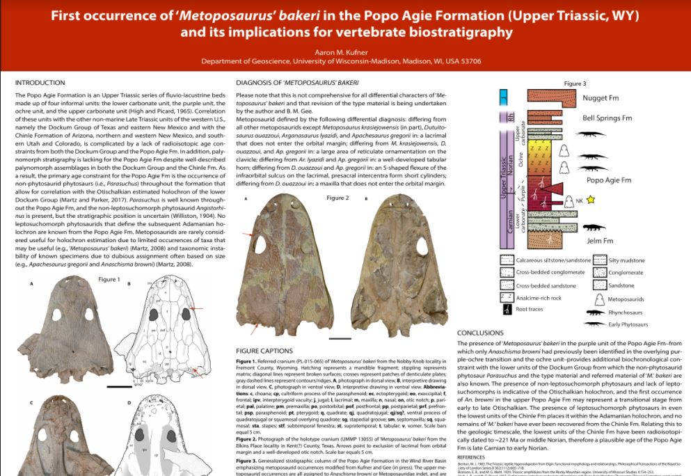

# First occurrence <i>'Metoposaurus' bakeri</i> in the Popo Agie Formation (Upper Triassic, WY) and implications for vertebrate biostratigraphy

**Aaron Kufner**

**Abstract**: The Popo Agie Formation of the Chugwater Group in Wyoming is a series of fluvio-lacustrine sandstone and mudstone beds with carbonaceous components at the bottom and top of the formation. No geochronologic constraints independent of vertebrate biostratigraphy are available to date the Popo Agie Fm beyond the Late Triassic. All previously known metoposaurids–characteristic Late Triassic temnospondyl amphibians with a near global distribution–from the Popo Agie Fm have been assigned to the species <i>Anaschisma browni</i> and were found in the upper units (purple-ochre transition and the ochre unit) of the Popo Agie Fm. Radioisotopically dated units in the Chinle Formation of Arizona that yield <i>A. browni</i> are no older than the middle Norian (<221 Ma), but workers generally agree that occurrences of the species _‘Metoposaurus’ bakeri_ within the Dockum Group of Texas lower than occurrences of _A. browni_ represent an older fauna (often referred to as Otischalkian) and may be late Carnian-early Norian in age. Here I demonstrate the presence of a second metoposaurid species referable to _‘M.’_ bakeri but from the lower purple unit of the Popo Agie Fm. This corresponds well with the other tetrapods of the Popo Agie Fm that are more similar to the tetrapod fauna of the lowest units of the Dockum Group than they are to the fauna from the lowest units of the Chinle Fm. This suggests that deposition of both the lowest Popo Agie Fm and lowest Dockum Group preceded Chinle Fm deposition.

**Advisor**: David Lovelace

**Stream**: [Zoom](https://uwmadison.zoom.us/meeting#/test11111)

**Email**: [akufner@wisc.edu](mailto:akufner@wisc.edu)

#### Poster

