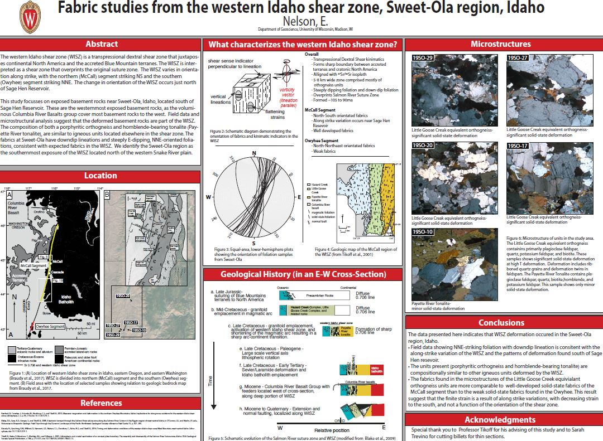

# Fabric studies from the western Idaho shear zone, Sweet-Ola region, Idaho

**Ellen Nelson**

**Abstract**: The western Idaho shear zone (WISZ) is a transpressional dextral shear zone that juxtaposes continental North America and the accreted Blue Mountain terranes. The WISZ is interpreted as a shear zone that overprints the original suture zone.  The WISZ varies in orientation along strike, with the northern (McCall) segment striking NS and the southern (Owyhee) segment striking NNE.  The change in orientation of the WISZ occurs just north of Sage Hen Reservoir.

This study focusses on exposed basement rocks near Sweet-Ola, Idaho, located south of Sage Hen Reservoir.  These are the westernmost exposed basement rocks, as the voluminous Columbia River Basalts Groups cover most basement rocks to the west.  Field data and microstructural analysis suggest that the deformed basement rocks are part of the WISZ.  The composition of both a porphyritic orthogneiss and hornblende-bearing tonalite (Payette River tonalite), are similar to igneous units located elsewhere in the shear zone. The fabrics at Sweet-Ola have downdip lineations and steeply E-dipping, NNE-oriented foliations, consistent with expected fabrics in the WISZ.  We identify the Sweet-Ola region as the southernmost exposure of the WISZ located north of the western Snake River plain.  

**Advisor**: Basil Tikoff

**Stream**: [Zoom](https://uwmadison.zoom.us/meeting#/test11111)

**Email**: [emnelson8@wisc.edu](mailto:emnelson8@wisc.edu)

#### Poster
Click to see the raw file:

