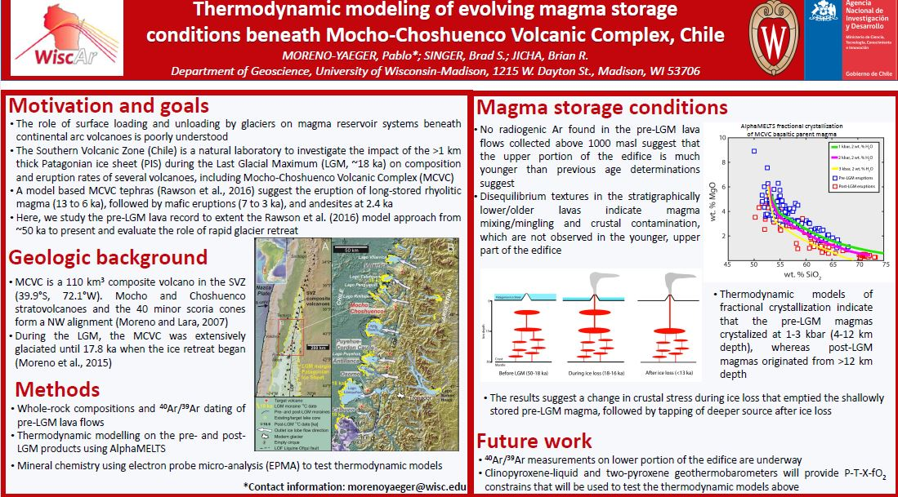

# Three-dimensional Permeability Inversion Using Convolutional Neural Networks for Better Prediction of Contaminant Transport in Aquifer Materials

**Pablo Moreno-Yaeger**

**Abstract**: The Mocho-Choshuenco Volcanic Complex (MCVC, 39.9°S) is one of the most active volcanoes in the Southern Volcanic Zone (SVZ) with >20 km3 Holocene tephra products erupted from 13 ka to 1864 A.D. Radiocarbon ages coupled with tephra compositions have led to a model (Rawson et al., 2016) of magma reservoir response to rapid unloading of >1 km thick glaciers during the local Last Glacial Maximum (LGM, 18-16 ka). This model suggests that unloading triggers magma ascent and eruption of long-stored silicic magma from 13 to 8 ka, followed by refilling of the reservoir to produce mafic eruptions from 7 to 3 ka, and uptick in andesitic activity in the last 2.4 ka. However, the Holocene tephras only provide a record of post-LGM explosive eruptions. Here we test this model by estimating thermodynamic parameters of both pre-LGM lava flows, in addition to several of the Holocene tephras.

Recent  40Ar/39Ar  measurements in WiscAr Lab on pre-LGM lavas indicate that much of the upper portion of the edifice is younger than previous ages determined by the SERNAGEOMIN. Moreover, petrography and geochemistry analysis suggest two distinct groups in the lava flows of MCVC. The first group is comprised by basaltic andesites with 20-30% crystals. The presence of glomerocrysts, sieve texture, zonation, and quenched mafic inclusions (QMI) suggest magma mixing/mingling processes, probably by a basaltic source. The second group is comprised by andesites and dacites with <10% crystals, and the lack of zonation, glomerocrysts and QMI, suggesting a different genesis compared to the first group. Thermodynamic models using the MELTS algorithm suggest crystallization at 1-3 kbar (4-12 km depth), with most post-LGM eruptions originating from a deeper portion of the reservoir system than the pre-LGM lavas. Electron probe microanalysis underway will test this hypothesis. Additional  40Ar/39Ar  dating underway and cosmogenic 3He exposure dating will constrain the latest Pleistocene eruptive history.

**Advisor**: Brad Singer

**Co-Authors**: Brad S. Singer, Brian R. Jicha

**Stream**: [Zoom](https://uwmadison.zoom.us/meeting#/test11111)

**Email**: [morenoyaeger@wisc.edu](mailto:morenoyaeger@wisc.edu)

#### Poster

