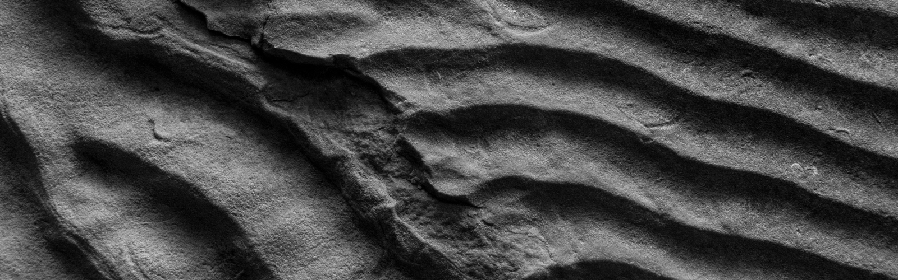

# Poster Presentations

#### Line-up
The poster session goes live on Thursday (April 22nd) at 1:30 pm CDT on the [Zoom](https://uwmadison.zoom.us/j/99393574894).

| Presenter   | Title       |Time| Link |
| ----------- | ----------- |------|-------|
| Zitong Huang   | Three-dimensional Permeability Inversion Using Convolutional Neural Networks for Better Prediction of Contaminant Transport in Aquifer Materials  | 13:30-13:45| [Abstract](https://wisc-geo-symposium21.github.io/pages/poster/zhuang)|
| Aaron Kufner  | First occurrence _Metoposaurus bakeri_ in the Popo Agie Formation (Upper Triassic, WY) and implications for vertebrate biostratigraphy |13:45 - 14:00|  [Abstract](https://wisc-geo-symposium21.github.io/pages/poster/akufner) |
| Pablo Moreno-Yaeger | Thermodynamic modeling of magma storage conditions beneath Mocho-Choshuenco Volcanic Complex, Chile  |14:00-14:15|  [Abstract](https://wisc-geo-symposium21.github.io/pages/poster/pmorenoyaeger)|
| Ellen Nelson | Fabric studies from the western Idaho shear zone, Sweet-Ola region, Idaho |N/A|  [Abstract](https://wisc-geo-symposium21.github.io/pages/poster/enelson)|
