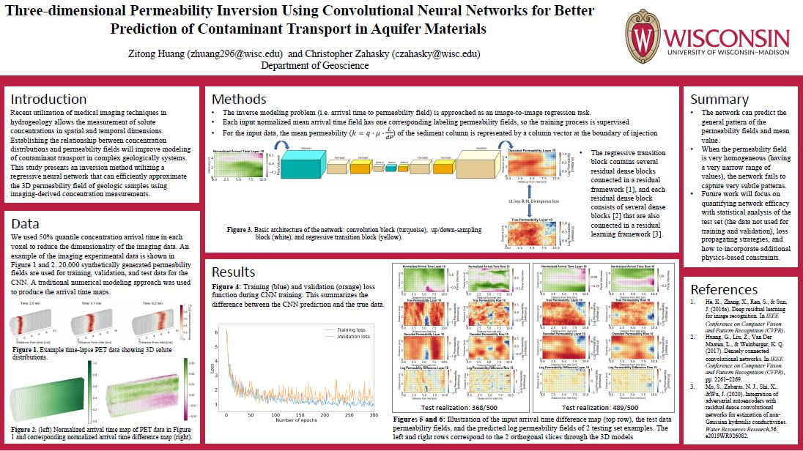

# Three-dimensional Permeability Inversion Using Convolutional Neural Networks for Better Prediction of Contaminant Transport in Aquifer Materials

**Zitong Huang**

**Abstract**: Understanding the transport of solutes inside of porous media is important for subsurface contaminant control. To model the transport, multiscale permeability heterogeneity characterization is required. However, measuring permeability across spatial scales remains a major challenge. Recent utilization of positron emission tomography (PET) allows for the measurement of solute transport in spatial and temporal dimensions. 3-D permeability heterogeneity characterization through these measurements is anticipated improve the modeling of contaminant transport in complex geologically relevant systems. This study aims to provide an inversion method through a deep convolutional encoder-decoder neural network utilizing multilevel residual learning strategy and the dense connection structure that can efficiently approximate the 3-D permeability field by using the temporal PET imaging measurements as input. Through the network, the inversion modeling task is transformed to an image-to-image regression task, which extracts high-level features from the high-dimensional inputs through encoder and then refines the features to invert the outputs through decoder. Our current network can invert the general pattern of the permeability fields and the mean permeability value. The network is expected to provide an accurate permeability heterogeneity characterization for simulating subsurface flow, which is important for subsurface contaminant control.

**Advisor**: Christopher Zahasky

**Co-Authors**: Christopher Zahasky

**Stream**: [Zoom](https://uwmadison.zoom.us/meeting#/test11111)

**Email**: [zhuang296@wisc.edu](mailto:zhuang296@wisc.edu)

#### Poster

